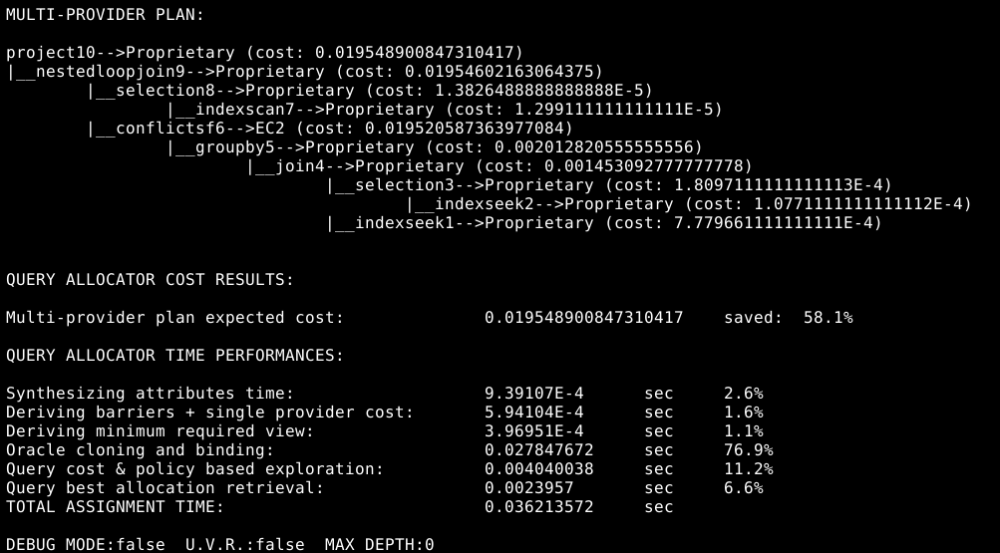
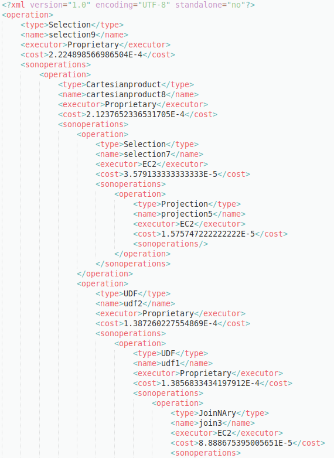

</img> </img>

# Query cost optimization for secure distribution 

Key question: *Is it possible to build a complex hybrid "optimizer" that allows to process complex, __collaborative and cheaper query execution__ plans reaping the benefits of open cloud markets?*  

This project focuses on cost optimization of query operations in a multi-provider context, in particular it aims to help finding cheaper execution configurations which are compliant to a specific safety policy. The tool has been developed and designed to be a proof-of-concept demonstrating the benefits that can be obtained adopting a distributed model of computation. 

Given the initial premises, the work greatly benefits from the open cloud market economy trying to speed up the deployment process of __distributed and pervasive computing__ systems.

Briefly, the construction focuses on:
* the development of a standard and simple set of statistics to describe query computation;
* the implementation of a security model to prevent information leaks [article](https://dl.acm.org/citation.cfm?id=3173076) [1];
* a simple but effective resolution of the assignment problem.

## Design principle


The supported computational paradigm is hybrid, in the sense that relational format and relational algebra are assumed as default, but the special concept of **User Defined Functions UDFs** is provided. The main motivation is to allow the processing of complex query/dataflow plans that transform data, potentially coming from distributed sensors, through heavy CPU demanding algorithms. The query optimizer treats these algorithms as UDFs: grey boxes described by performance and confidentiality profiles, as they could be developed separately using different programming paradigms.
We imagine a scenario in which:
* heavy _machine learning operators_ blocks are composed with relational ones to form hybrid query plans;
* the execution tissue take advantage of executors offering VMs. 

Every component has been implemented to be easily integrated (as long as operation's cost profiles are adjusted) inside a real two phase optimization chain of hybrid query optimizers, so, the intent is to devise the best possible configuration plan spending the least possible time. Particular attention has been dedicated to the validity of solutions: a multi-provider assignment has to guarantee that the expected total execution cost is lower than the expected single-provider one.

However, the cost proposed is an estimate of the real cost of execution; results have to be interpreted as: based the available statistics and models given by a first optimization step, an operation assignment like the one found by the tool allows to achieve proportional cost benefits if compared to the absolute estimate. It is foundamental to understand that the objective of this kind of analysis is the economic cost, not execution performance (a configuration could be slower but cheaper). In any case, an adaptive statistics model must be implemented in a real scenario.

### Brief results example

Results produced by the tool are composed by:
* a short XML representation of th plan printing operation's cost and assignment;
* an extended XML representation in which even _relation profiles_ and output encryption wrapping moves are specified;
* a simple query tree console print to accelerate development.

In the following a brief example of console results.

</img>

## Notes and acknowledgments

This work has initially been developed as a complement to my MSc thesis. It was also my first java "real" project, so I took the opportunity to learn the basics of the language (please turn a blind eye on the errors present).</p>

The work started because of the need to prove the benefits proposed in [1], then it has evolved trying to explore some of the UniBg Seclab group's research line by proposing new ideas. I would like to thank prof. Stefano Paraboschi for giving me the chance to learn and for the disposability shown. A special thanks goes even to the Ph.Ds Enrico Bacis and Marco Rosa for the valuable advice gived to me in the whole problem resolution and development phases.

A clarification of some of the starting assumptions and a more precise description can be found in final thesis relation.

## Getting started
Currently the entire repository moved into a Maven project, so it is required to compile and run .

## Installing and executing
To compile the project go to the main directory and run
```
mvn package
```
to execute a simple demo run it is enough to go to 
```
cd ./src/main/java/Launcher
```
and to launch
```
./demo.sh
```
the script can be launched specifying the options
```
no_uvr debug_mode depth=5
```
respectively to remove uniform visibility rule, launch in debug mode and set maximum exhaustive binary search with depth 5. 

The script contains a set of three queries acting like a simple "benchmark".

## Results
The results of the execution are saved into
```
./src/main/java/Launcher/OutputData/ResultExtended__.xml  
./src/main/java/Launcher/OutputData/ResultShor__t.xml
```
while the processing report (only constructed in debug mode), can be found in
```
./src/main/java/Launcher/OutputData/Reports/report__.txt  
```
The following image shows results example.

</img>


